# 📸 Image Database Management System

<div align="center">

[](https://opensource.org/licenses/MIT)
[](https://nodejs.org/)
[](https://www.postgresql.org/)
[](https://nextjs.org/)

*A full-stack web application for centralized image storage and management, designed for manufacturing environments.*

</div>

---

## 🌟 Features

<details>
<summary><strong>🔧 Core Functionality</strong></summary>

- **🔒 Secure Image Upload**: Batch upload with intuitive drag-and-drop support
- **📁 Organized Storage**: Images intelligently grouped by part numbers with structured folders
- **🖼️ Advanced Gallery**: Beautiful grid view with part-based grouping and powerful search
- **📊 Comprehensive Dashboard**: Real-time statistics, recent uploads, and quick actions
- **🏷️ Metadata Management**: Track detailed image information, camera data, and capture settings

</details>

<details>
<summary><strong>⚡ Technical Features</strong></summary>

- **📱 Responsive Design**: Seamless experience across desktop, tablet, and mobile devices
- **🔄 Real-time Updates**: Live upload progress tracking and instant status updates
- **🛡️ Error Handling**: Robust error management with user-friendly messages
- **🔍 Image Preview**: Full-screen viewing with smooth keyboard navigation
- **⬇️ Download Support**: Multiple download methods with intelligent fallback options

</details>

---

## 🏗️ Architecture Overview

```mermaid
graph TB
    A[👤 User] --> B[🌐 Next.js Frontend]
    B --> C[🔐 Clerk Auth]
    B --> D[🚀 Express.js Backend]
    D --> E[🐘 PostgreSQL]
    D --> F[🗄️ MinIO Storage]
    
    style A fill:#ffffff,stroke:#000000,color:#000000
    style B fill:#ffffff,stroke:#000000,color:#000000
    style C fill:#ffffff,stroke:#000000,color:#000000
    style D fill:#ffffff,stroke:#000000,color:#000000
    style E fill:#ffffff,stroke:#000000,color:#000000
    style F fill:#ffffff,stroke:#000000,color:#000000
```



<details>
<summary><strong>🔧 System Components</strong></summary>

| Component | Technology | Purpose |
|-----------|------------|---------|
| **Frontend** | Next.js 15 + React 19 + TypeScript | Modern, responsive user interface |
| **Backend** | Node.js + Express.js | RESTful API and business logic |
| **Database** | PostgreSQL | Metadata and relational data storage |
| **Object Storage** | MinIO | Scalable image file storage |
| **Authentication** | Clerk | Secure user management |

</details>

---

## 🛠️ Technology Stack

<details>
<summary><strong>🎨 Frontend Stack</strong></summary>

```json
{
  "framework": "Next.js 15.3.2",
  "ui_library": "React 19.1.0",
  "language": "TypeScript 5",
  "styling": "Tailwind CSS 3.4.17",
  "authentication": "Clerk"
}
```

</details>

<details>
<summary><strong>⚙️ Backend Stack</strong></summary>

```json
{
  "runtime": "Node.js",
  "framework": "Express.js 5.1.0",
  "database": "PostgreSQL",
  "object_storage": "MinIO 8.0.5",
  "file_handling": "Multer 2.0.2"
}
```

</details>

<details>
<summary><strong>📦 Key Dependencies</strong></summary>

| Package | Version | Purpose |
|---------|---------|---------|
| `pg` | 8.16.0 | PostgreSQL client |
| `cors` | 2.8.5 | Cross-origin resource sharing |
| `dotenv` | 16.5.0 | Environment configuration |
| `exif-parser` | 0.1.12 | Image metadata extraction |
| `image-size` | 2.0.2 | Image dimension detection |

</details>

---

## 🚀 Quick Start

<details>
<summary><strong>📋 Prerequisites</strong></summary>

Before you begin, ensure you have the following installed:

- [Node.js](https://nodejs.org/) 18.17.0 or later
- [PostgreSQL](https://www.postgresql.org/) 12 or later
- [MinIO](https://min.io/) server or S3-compatible storage
- npm or yarn package manager

</details>

<details>
<summary><strong>📥 Installation</strong></summary>

### 1️⃣ Clone the Repository
```bash
git clone <repository-url>
cd Image_Database-main
```

### 2️⃣ Backend Setup
```bash
cd Glory_Backend
npm install
```

Create `.env` file:
```env
# Server Configuration
SERVER_PORT=8000

# PostgreSQL Configuration
PG_HOST=localhost
PG_PORT=5432
PG_USER=your_username
PG_PASSWORD=your_password
PG_DATABASE=your_database

# MinIO Configuration
MINIO_ENDPOINT=localhost
MINIO_PORT=9000
MINIO_ACCESS_KEY=minioadmin
MINIO_SECRET_KEY=minioadmin
MINIO_BUCKET=part-images
MINIO_USE_SSL=false
```

Initialize database and start server:
```bash
node create-table.js
npm start
```

### 3️⃣ Frontend Setup
```bash
cd ../image-database
npm install
```

Create `.env.local` file:
```env
# Clerk Authentication
NEXT_PUBLIC_CLERK_PUBLISHABLE_KEY=your_clerk_publishable_key
CLERK_SECRET_KEY=your_clerk_secret_key

# API Configuration
NEXT_PUBLIC_API_BASE_URL=http://localhost:8000
NEXT_PUBLIC_MINIO_URL=http://localhost:9000
```

Start development server:
```bash
npm run dev
```

### 4️⃣ MinIO Setup
```bash
# Using Docker
docker run -p 9000:9000 -p 9001:9001 \
  -e "MINIO_ROOT_USER=minioadmin" \
  -e "MINIO_ROOT_PASSWORD=minioadmin" \
  minio/minio server /data --console-address ":9001"
```

Access MinIO Console at `http://localhost:9001` and create the required bucket.

</details>

---

## 🗄️ Database Schema

<details>
<summary><strong>📊 Table Structure</strong></summary>

### Parts Table
```sql
CREATE TABLE parts (
    id SERIAL PRIMARY KEY,
    part_name VARCHAR(255) NOT NULL,
    part_number VARCHAR(100) UNIQUE NOT NULL,
    description TEXT,
    category VARCHAR(100),
    created_at TIMESTAMP DEFAULT CURRENT_TIMESTAMP,
    updated_at TIMESTAMP DEFAULT CURRENT_TIMESTAMP
);
```

### Camera Table
```sql
CREATE TABLE camera (
    id SERIAL PRIMARY KEY,
    device_model VARCHAR(255),
    location VARCHAR(255),
    serial_number VARCHAR(255)
);
```

### Images Table
```sql
CREATE TABLE images (
    id SERIAL PRIMARY KEY,
    file_path TEXT NOT NULL,
    file_name VARCHAR(255) NOT NULL,
    file_type VARCHAR(50),
    image_size BIGINT,
    captured_at TIMESTAMP,
    bucket_name VARCHAR(100),
    part_id INTEGER REFERENCES parts(id),
    camera_id INTEGER REFERENCES camera(id)
);
```

### Metadata Table
```sql
CREATE TABLE metadata (
    id SERIAL PRIMARY KEY,
    image_id INTEGER REFERENCES images(id),
    resolution VARCHAR(50),
    capture_mode VARCHAR(100),
    notes TEXT
);
```

</details>

---

## 🔌 API Reference

<details>
<summary><strong>🖼️ Image Endpoints</strong></summary>

| Method | Endpoint | Description |
|--------|----------|-------------|
| `GET` | `/images` | Retrieve all images |
| `GET` | `/images/:id` | Get specific image |
| `GET` | `/images?part_number=XXX` | Filter by part number |
| `POST` | `/upload-folder` | Upload multiple images |
| `PUT` | `/images/:id` | Update image metadata |
| `DELETE` | `/images/:id` | Delete image |
| `GET` | `/images/download/:id` | Download image |

</details>

<details>
<summary><strong>📈 Statistics & Parts Endpoints</strong></summary>

| Method | Endpoint | Description |
|--------|----------|-------------|
| `GET` | `/images/stats` | Get database statistics |
| `GET` | `/parts/:partNumber` | Validate part number |
| `GET` | `/categories` | List available categories |

</details>

---

## 💡 Usage Guide

<details>
<summary><strong>🔐 Authentication</strong></summary>

1. Visit the application homepage
2. Click **"Sign In"** and create an account via Clerk
3. Access the dashboard after successful authentication

</details>

<details>
<summary><strong>⬆️ Uploading Images</strong></summary>

1. Navigate to the **Upload** page
2. Enter a valid part number
3. Select files or use drag-and-drop functionality
4. Add optional notes for context
5. Click **"Upload"** to process files

</details>

<details>
<summary><strong>👀 Viewing Images</strong></summary>

1. Use the **Dashboard** for recent uploads overview
2. Visit the **Gallery** for organized part-based viewing
3. Search by part number or browse by categories
4. Click images for full-screen viewing with metadata display

</details>

<details>
<summary><strong>🛠️ Managing Images</strong></summary>

- **Download**: Individual image downloads
- **Delete**: Remove images with confirmation dialogs
- **Edit**: Modify metadata and notes
- **Navigate**: Use keyboard shortcuts for browsing

</details>

---

## 📁 File Storage Structure

<details>
<summary><strong>🗂️ MinIO Organization</strong></summary>

```
part-images-bucket/
  ├── 📁 PART-001/
  │   ├── 🖼️ front-view.jpg
  │   ├── 🖼️ side-view.png
  │   └── 🖼️ detail-shot.jpg
  ├── 📁 PART-002/
  │   ├── 🖼️ assembly.jpg
  │   └── 🖼️ components.png
  └── 📁 PART-XXX/
      └── 🖼️ ...
```

</details>

---

## 🚀 Development

<details>
<summary><strong>🔧 Development Mode</strong></summary>

### Backend Development
```bash
cd Glory_Backend
npm run dev  # Uses nodemon for auto-restart
```

### Frontend Development
```bash
cd image-database
npm run dev  # Next.js development server with hot reload
```

</details>

<details>
<summary><strong>🏗️ Production Build</strong></summary>

### Backend Production
```bash
npm run build
npm start
```

### Frontend Production
```bash
npm run build
npm start
```

</details>

---

## 🔧 Troubleshooting

<details>
<summary><strong>🔍 Common Issues & Solutions</strong></summary>

### Backend Connection Errors
- ✅ Verify PostgreSQL is running and accessible
- ✅ Check database credentials in `.env` file
- ✅ Ensure MinIO server is running on correct port

### Frontend Authentication Issues
- ✅ Verify Clerk keys are correctly configured
- ✅ Check if Clerk application is properly set up in dashboard

### Image Upload Failures
- ✅ Confirm MinIO bucket exists and is accessible
- ✅ Check file size limits and supported formats
- ✅ Verify backend API is running and reachable

### CORS Issues
- ✅ Ensure CORS is properly configured in backend
- ✅ Check if frontend URL is allowed in backend settings

</details>

<details>
<summary><strong>🐛 Debug Mode</strong></summary>

Enable debug logging by setting:
```env
NODE_ENV=development
DEBUG=true
```

</details>

---

## 📝 Contributing

<details>
<summary><strong>🤝 How to Contribute</strong></summary>

1. 🍴 Fork the repository
2. 🌿 Create a feature branch (`git checkout -b feature/amazing-feature`)
3. 🧪 Make changes with proper testing
4. 📝 Commit your changes (`git commit -m 'Add some amazing feature'`)
5. 📤 Push to the branch (`git push origin feature/amazing-feature`)
6. 🔄 Submit a pull request with detailed description

</details>

---

## 📊 Project Information

<details>
<summary><strong>📈 Version & Stats</strong></summary>

| Item | Value |
|------|-------|
| **Application Version** | 1.0.0 |
| **Node.js Minimum** | 18.17.0 |
| **PostgreSQL Recommended** | 12+ |
| **MinIO Compatibility** | S3 API Compatible |
| **Last Updated** | January 2025 |

</details>

<details>
<summary><strong>📄 License</strong></summary>

This project is licensed under the MIT License - see the [LICENSE](LICENSE) file for details.

</details>

<details>
<summary><strong>🆘 Support</strong></summary>

For support and questions:
- 📖 Review this documentation
- 🔍 Check the troubleshooting section
- 🐛 Create an issue in the repository
- 📧 Contact the development team

</details>

---

<div align="center">


</div>
